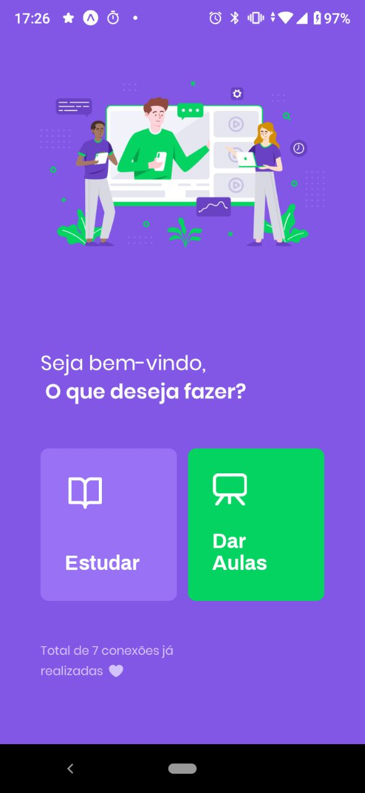

## Table of contents
* [Display](#display)
* [General info](#general-info)
* [Technologies](#technologies)
* [Setup](#setup)
* [Project](#project)

## Display



## General info
Rep for projects built during Next Level Week from RocketSeat.
Language of the project is in Brazilian Portuguese [pt-br].
	
## Technologies
Project is created with:
* Node version: v12.14.0
* Yarn version: v1.22.4
	
## Setup
To run this project, install it locally using npm, first initiate server, then run either mobile or web version:

```
$ cd ../server
$ yarn
$ cd ../mobile
$ yarn
$ yarn start
```

## Project
    (src)
    |--- @types
    |--- assets
    |       |---images
    |              |---icons
    |---components
            |---PageHeader
            |---TeacherItem
    |---pages
            |---Favourites
            |---GiveClasses
            |---Landing
            |---TeacherList
    |---routes
            |---AppStack.tsx
            |---StudyTabs.tsx
    |---services
            |---api.ts

    package.json
    App.tsx
