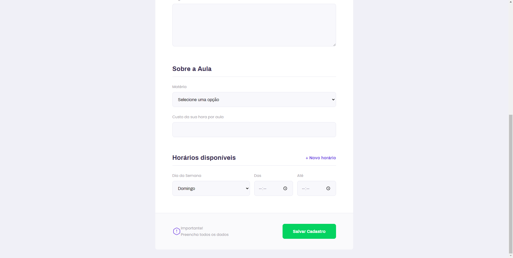

## Table of contents
* [Display](#display)
* [General info](#general-info)
* [Technologies](#technologies)
* [Setup](#setup)
* [Project](#project)

## Display





## General info
Rep for projects built during Next Level Week from RocketSeat.
Language of the project is in Brazilian Portuguese [pt-br].
	
## Technologies
Project is created with:
* Node version: v12.14.0
* Yarn version: v1.22.4
	
## Setup
To run this project, install it locally using npm, first initiate server, then run web version:

```
$ cd ../server
$ yarn
$ cd ../web
$ yarn
$ yarn start
```

## Project

    (public)
        |---index.html
    (src)
        |--- assets
        |       |---images
        |       |      |---icons
                |---styles
                        |---global.css
        |---components
                |---PageHeader
                |---TeacherItem
                |---Textarea
                |---Select
                |---Input
        |---pages
                |---Landing
                |---TeacherForm
                |---TeacherList
        |---routes
                |---AppStack.tsx
                |---StudyTabs.tsx
        |---services
                |---api.ts
        react-app-env.d.ts
        routes.tsx
        package.json
        App.tsx
